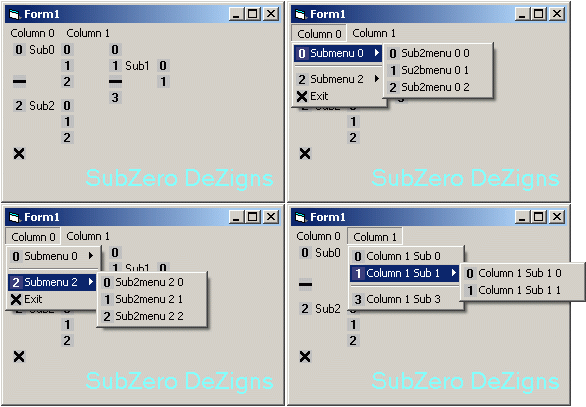



## Menu Icon SubMenu Icon

### Description

This Example will show you how to add icons to the Submenu Submenu. Most of the examples of placing icons to the submenu do not show the Submenu Submenu icons. This will show you how at runtime.

This will also show you how to add icons to the submenu popout menu submenu. Using 0 will not place an icon into that index. This will show you how using MF_BYPOSITION.

Enjoy!

Thanks,

Quake
 
### More Info
 

             |
---                |---
**Submitted On**   |2012-06-18 00:56:22
**By**             |[Quake](https://github.com/Planet-Source-Code/PSCIndex/blob/master/ByAuthor/quake.md)
**Level**          |Advanced
**User Rating**    |5.0 (10 globes from 2 users)
**Compatibility**  |VB 6\.0
**Category**       |[Custom Controls/ Forms/  Menus](https://github.com/Planet-Source-Code/PSCIndex/blob/master/ByCategory/custom-controls-forms-menus__1-4.md)
**World**          |[Visual Basic](https://github.com/Planet-Source-Code/PSCIndex/blob/master/ByWorld/visual-basic.md)
**Archive File**   |[Menu\_Icon\_2225136182012\.zip](https://github.com/Planet-Source-Code/quake-menu-icon-submenu-icon__1-74398/archive/master.zip)

